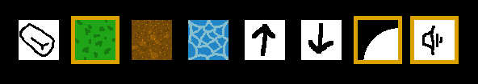

# Discovery of Software Engineering - my_world

This is an **Epitech project** called my_world.

Its a project two week from the the second semester of the Epitech **Discovery of Software Engineering module** (**G-ING-200**).

## Project Overview

The goal of this project is to **display a map and edit it at runtime**.

The languages used are **C** and **CSFML**.

We've used **OpenGL Shading Language (GLSL)**, for the shaders.

## Epitech Warning

**This is a warning to all epitech students:** 
- **We recall you that being a copycat at EPITECH will not bring you any good.**
- **Copying is totally banned at EPITECH and by not respecting this rule you can be scolded.**

## Prerequisites

- _Make_	([Librairie Make](https://www.gnu.org/software/make/manual/make.html))
- _GCC_		([Librairie gcc](https://devdocs.io/gcc~14/))
- _LibC_	([Librairie C](https://www.gnu.org/software/libc/))
- _LibCsfml_	([Librairie CSFML](https://csfml.1l.is/index.html))

## Compilation

- *You can compile the project using the provided Makefile:*

```bash
make
# --> this will create a binary at the root of your repository, named my_world.
```

- *To see what you can do with the Makefile, type:*

```bash
make help
# --> this will display every usages of the make command.
```

- *You can compile this binary using:*

```
./my_world
# --> to open an empty map that you can customize.

./my_world map.legend
# --> to open a saved map that you can customize.

./my_world x y
# --> to open a map with the given size.
# --> WARNING: x and y have to be between 1 and 150, or else it won't work.

./my_world -h
# --> to display this README as a -h.
```

## KEYBOARD CONTROLS

| Keys | Allow the user to |
| :---------------: | :---------------: |
| "Z", "Q", "S" and "D" | move in the window |
| arrow keys | change the point of view |
| "I", or using your mouse wheel | zoom in |
| "O", or using your mouse wheel | zoom out |
| "P" | randomize the map heights, using the "Perlin Noise" |
| "R" | retexture the map (after a Perlin Noise for example) |
| "G" | turn on/off the map grid |
| "Ctrl" + "Enter" simultaneously | save the actual map |

> **After pressing "Ctrl" + "Enter", the map will be saved in the directory saved_maps, as map_day_month_year_hour_min_sec.legend.**

## WINDOW BUTTONS:

**In the top left, of the window, there are different buttons that allow you to select what to modify on the map.**



| Button | Name | Description |
| :---------------: | :---------------: | :---------------: |
| 1 | eraser | Turn the user's mouse into an eraser, allowing him to remove textures. |
| 2 | grass | Allow the user to put grass on a tile, by clicking on it. |
| 3 | dirt | Allow the user to put dirt on a tile, by clicking on it. |
| 4 | water | Allow the user to put water on a tile, by clicking on it. |
| 5 | increase | Allow the user to increase the height of a point of the map. |
| 6 | decrease | Allow the user to decrease the height of a point of the map. |
| 7 | shaders | Allow the user to turn ON or turn OFF the shaders. |
| 8 | sounds | Allow the user to turn ON or turn OFF the sounds and the music. |

*You can also use a number pad to select one of the textures you want to use (between 0 and 4).*

## Authors

-	Tanguy Folliot 			([Github](https://github.com/jf1Phillips))
-	Quentin Dutournier-Ottenin 	([Github](https://github.com/Patate-with-computer))
